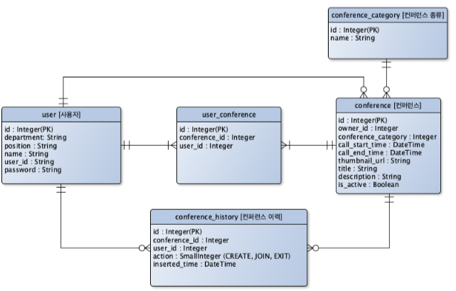

# 공통 프로젝트

## 1. 반응형 단일 페이지 애플리케이션 구현

### 1-1. 프로젝트 개요

- WebRTC를 활용한 화상 회의 기능을 갖춘 **"그룹 비디오 컨퍼런스 서비스"**를 개발
- Front-end
  - Vue(ver.3)를 기반으로 하는 반응형 SPA
- Back-end
  - Java와 Spring Boot를 기본으로 WebSocket, WebRTC르포토콜을 활용하여 필요 기능을 구현하고 Rest API를 적용
- WebRTC 프로토콜을 효과적으로 사용하기 위해, Media Server를 설치하여 별도의 스트피밍 서버로 활용

### 1-2. 진행 과정

| 단계      | 기간   | 세부사항                                                     |
| --------- | ------ | ------------------------------------------------------------ |
| Sub PJT 1 | Week 1 | 1) 개발 환경 설정 2) 프로젝트 디렉토리 구조 설명 3) Sub 1. 진행에 필요한 주요 개념 정리 4) 회원가입, 로그인 기능 구현 |
| Sub PJT 2 | Week 2 | 1) 방 정보에 대한 CRUD API 기능 구현 2) 방 목록 조회/검색/정렬 기능 구현 3) 방 상세 보기 기능 구현 4) 방 정보 편집 기능 구현 5) WebRTC를 위한 미디어 서버 설정 6) Dockerizing 및 배포 가이드 |
| Sub PJT 3 | Week 3 | 1) 그룹 화상 컨퍼런스 콜 기능 구현 2) 그룹 채팅 기능 구현 3) 심화 기능 구현 |

### 1-3. 목표

1) 웹 서비스 개발에 대한 기본적인 이해

2. Vue 웹 Front-end 어플리케이션 개발 스킬 습득
3. 반응형 웹 Front-end 개발 스킬 습득
4. Back-end 애플리케이션 개발 스킬 습득
5. WebRTC 기술을 활용한 프로젝트 개발 경험
6. Git과 Jira를 활용한 이슈 트래킹 등의 개발 실무 경험

### 4. 프로젝트 진행에 참고할 내용

- 세션 인증과 토큰 인증

  - 사용자의 인증과 관련된 기능은 가장 기본적인 기능이자 가장 중요한 기능

  1. JWT (Json Web Token) 토큰 활용하는 방식
  2. 세션을 사용하는 방식

- ORM

  - DB의 테이블 및 필드를 객체와 매핑하는 방식 사용

  1. JPA
  2. Hibernate
     - JPA의 구현체 역할을 하는 Java ORM 프레임워크
  3. QueryDSL
     - type-safe한 쿼리의 제작과 실행을 위해 사용하는 프레임워크
     - String으로 쿼리를 직접 작성할 때 발생할 수 있는 오타 혹은 잘못된 테이블의 참조, 낮은 가독성 등의 단점을 극복할 수 있게 도와준다.

- Vue

  - 웹 서비스 구현 시 SPA 개발을 위해 사용하는 JS 프레임워크

  1. Vue 3
     - 어플리케이션 인스턴스 생성
       - 인스턴스 생성에 createApp 함수를 사용
     - fragments
       - 최상단 \
 사용이 강제되지 않음
     - Composition API
       - 코드의 재사용성과 가독성을 높이고, 유지보수 측면에서도 효율을 높여 코드 내 논리적 관심사에 더 집중 가능
       - setup()을 사용
     - Lifecycle Hooks
       - 접두어 "on"을 추가하여 컴포넌트의 라이프사이클 훅에 접근가능
     - props와 emit의 분리
       - Vue3에서는 Composition API의 setup()에서 전달인자로 명시하는 방식을 사용해 가독성을 높인다.
     - Component Lifecycle
  2. Vue 3 라이브러리
     - Element Plus
       - Vue 3 기반의 UI 프레임워크
       - Vue 3 기반의 SPA 개발을 위한 다양한 기능을 제공
     - Vuex
       - 중앙 집중식 즉, 공통적으로 Vue의 여러 컴포넌트 상태 관리 기능을 제공하는 state management pattern 라이브러리
       - Vuex 4를 활용하여 SPA를 개발
       - 중대형규모의 SPA를 구축할 때 Vue 컴포넌트의 효율적인 상태 처리를 위해 사용
       - 인증 토큰 관리, 반응형 상태 처리, 메뉴 상태 처리, 공통 Websocket 이벤트 관리 등의 기능 구현

### 5. 소프트웨어 요구사항 명세서 (Software Requirement Specification)

#### **Front-end 요구사항**

1. 공통

   - 인증/토큰 관리

     - 로그인 및 토큰 발급 시, 해당 토큰을 localStorage에 저장하여 관리

     

     - 페이지 진입 시
       - 토큰이 존재할 경우
         - 해당 토큰을 통해 해당 유저의 정보를 받아온다.
         - 각 분류 별 (로그인) 화면을 표시한다.
       - 토큰이 존재하지 않을 경우
         - 각 분류 별 (비로그인)화면을 표시한다.
       - 이 말은 maybe JWT Token 사용하라는 말 같음

     

     - 공용 Axios 처리
       - 토큰이 존재할 경우
         - { Authorization : Bearer 토큰 값 }으로 헤더에 전송
       - 에러 처리
         - 응답코드 401
           - SignatureVerificationException 또는 JWTDecodeException
             - "세션이 유효하지 않습니다." 팝업 표시
             - 로그 아웃 처리
           - TokenExpiredException
             - "세션이 만료되었습니다." 팝업 표시
             - 로그 아웃 처리
         - 응답 코드 403
           - Forbidden
             - "접근 권한이 없습니다." 팝업 표시
             - 로그 아웃 처리
           - 로그 아웃 처리
             - localStorage에서 토큰 삭제
             - "홈" 메뉴로 이동

   

   - 로딩 스피너
     - Front-end 영역에서 기능 수행의 응답 완료 시점까지 사용자의 다른 인터랙션을 방지하기 위해 사용
     - Element Plus의 Notice > Loading을 활용하여 아래 화면 목록에 적용
       - 홈 > 방 목록 조회
         - 전체 조회
         - 검색
         - 정렬
       - 홈 > 방 목록 > 방 상세 정보
       - 지난 회의 이력

   

   - 입력 필드 유효성 체크
     - Element Plus의 Validation을 활용하여, 입력 필드의 유효성 체크가 실패했을 경우 입력 폼에 에러 메시지를 표시

2. 네비게이션 (비로그인)

   - 메뉴
     - 비 로그인 상태의 사이드 메뉴에서는 다음 메뉴만 표시
       - 홈
       - 회원 가입 버튼
     - 비 로그인 상태의 GNB(네비게이션)에서 회원 가입 버튼을 표시
       - Default 타입으로 표시
       - 아이콘 버튼 (Basic - Button - Icon Button)으로 el-icon-circle-plus-outline 아이콘과 "회원 가입" 텍스트를 표시
     - 마우스 이벤트
       - 클릭 시, 회원 가입 팝업을 표시

   

   - 회원 가입 팝업
     - 헤더
       - 타이틀 : 회원가입
       - 우측에 닫기 버튼을 아이콘으로 표시
     - 컨텐츠
       - 소속
         - "소속" 레이블 표시
         - 텍스트 입력 필드 표시
         - 유효성 체크
           - 30자 까지 입력 가능
           - 에러 메시지 : 최대 30자까지 입력 가능
           - 필수 입력 항목 아님 (선택)
       - 직책
         - "직책" 레이블 표시
         - 텍스트 입력 필드 표시
         - 유효성 체크
           - 30자 까지 입력 가능
           - 에러 메시지 : 최대 30자까지 입력 가능
           - 필수 입력 항목 아님 (선택)
       - 이름
         - "이름" 레이블 표시
         - 텍스트 입력 필드 표시
         - 유효성 체크
           - 30자 까지 입력 가능
             - 에러 메시지 : 최대 30자까지 입력 가능
           - 필수 입력 항목
             - 에러 메시지 : 필수 입력 항목입니다.
       - 아이디
         - "아이디" 레이블 표시
         - 텍스트 입력 필드 표시
         - 중복 확인 버튼 표시
           - 클릭 이벤트
             - 백엔드 API를 호출하여 입력한 아이디를 가진 회원이 존재하는지 체크
         - 유효성 체크
           - 16자 까지 입력 가능
             - 에러 메시지 : 최대 16자까지 입력 가능합니다.
           - 필수 입력 항목
             - 에러 메시지 : 필수 입력 항목입니다.
           - 중복된 id가 없어야 함
             - 에러 메시지 : 이미 존재하는 아이디입니다.
             - 성공 메시지 : 사용 가능한 아이디입니다.
       - 비밀번호
         - "비밀번호" 레이블 표시
         - 비밀번호 입력 필드 표시
         - 유효성 체크
           - 최소 9글자 이상
             - 에러 메시지 : 최소 9 글자를 입력해야 합니다.
           - 최대 16글자
             - 에러 메시지 : 최대 16 글자까지 입력 가능합니다.
           - 영문 + 숫자 + 특수문자 조합
             - 에러 메시지 : 비밀번호는 영문, 숫자, 특수문자가 조합되어야합니다.
           - 필수 입력 항목
             - 에러 메시지 : 필수 입력 항목입니다.
       - 비밀번호 확인
         - "비밀번호" 확인 레이블 표시
         - 비밀번호 입력 필드 표시
         - 유효성 체크
           - 최소 9글자 이상
             - 에러 메시지 : 최소 9 글자를 입력해야 합니다.
           - 최대 16글자
             - 에러 메시지 : 최대 16 글자까지 입력 가능합니다.
           - 영문 + 숫자 + 특수문자 조합
             - 에러 메시지 : 비밀번호는 영문, 숫자, 특수문자가 조합되어야합니다.
           - 필수 입력 항목
             - 에러 메시지 : 필수 입력 항목입니다.
           - "비밀번호" 입력 값과 동일한 입력 값
             - 에러 메시지 : 입력한 비밀번호와 일치하지 않습니다.
       - "가입하기" 버튼
         - 소속, 직책, 이름, 아이디, 비밀번호, 비밀번호 확인 필드에 키보드 입력마다 유효성 체크
         - 중복 확인 버튼 클릭 결과에 따라 유효성을 체크
           - 유효하지 않은 경우 가입하기 버튼 비활성화
           - 유효한 경우 가입하기 버튼 활성화
         - 클릭 이벤트
           - 팝업 내 로딩 스피너가 표시
           - 회원 가입 API를 호출
           - API 응답 결과에 따라 팝업 메시지를 표시
             - 성공
               - 로딩 스피너가 사라지고, 회원 가입 팝업이 닫힌 후 팝업 메시지를 표시
               - 메시지 : "회원 가입이 완료되었습니다."
             - 실패
               - 로딩 스피너가 사라지고, 회원 가입 팝업이 유지된 후 팝업 메시지를 표시
               - 메시지 : "회원 가입에 실패하였습니다."
   - 로그인
     - 비 로그인 상태의 GNB(네비게이션)에서 로그인 버튼을 표시
       - Primary 타입으로 표시
       - 아이콘 버튼 (Basic - Button - Icon Button)으로 el-icon-key 아이콘과 "로그인" 텍스트 표시
     - 헤더
       - 타이틀 : 로그인
       - 우측에 닫기 버튼을 아이콘으로 표시
     - 컨텐츠
       - 아이디
         - "아이디" 레이블 표시
         - 텍스트 입력 필드를 표시
         - 유효성 체크
           - 16자까지 입력 가능
             - 에러 메시지 : 최대 16자까지 입력 가능합니다.
           - 필수 입력 항목
             - 에러 메시지 : 필수 입력 항목입니다.
       - 비밀번호
         - "비밀번호" 레이블 표시
         - 비밀번호 입력 필드 표시
         - 유효성 체크
           - 최소 9글자 이상
             - 에러 메시지 : 최소 9 글자를 입력해야 합니다.
           - 최대 16글자
             - 에러 메시지 : 최대 16 글자까지 입력 가능합니다.
           - 영문 + 숫자 + 특수문자 조합
             - 에러 메시지 : 비밀번호는 영문, 숫자, 특수문자가 조합되어야합니다.
           - 필수 입력 항목
             - 에러 메시지 : 필수 입력 항목입니다.
       - "로그인" 버튼
         - 아이디, 비밀번호 필드에 키보드 입력마다 유효성 체크
           - 유효하지 않은 경우 로그인 버튼 비활성화
           - 유효한 경우 로그인 버튼 활성화
         - 클릭 이벤트
           - 팝업 내 로딩 스피너가 표시
           - 로그인 API를 호출
           - API 응답 결과에 따라 팝업 메시지를 표시
             - 성공
               - "인증 토큰 관리" 기능에 따라 토큰을 저장
               - "네비게이션(로그인)" 상태로 변경
             - 실패
               - 로딩 스피너가 사라지고, 로그인 팝업이 유지된 후 응답 결과의 에러메시지를 팝업 메시지로 표시

3. 네비게이션 (로그인)

   - 메뉴

     - 로그인 상태의 메뉴에서는 하기 메뉴를 표시

     - 홈
       - 집 모양의 아이콘을 텍스트와 함께 표시
       - 클릭 시, "홈 > 방 목록" 페이지로 이동
     - 지난 회의 이력
       - 서류 모양의 아이콘을 텍스트와 함께 표시
       - 클릭 시, "지난 회의 이력" 페이지로 이동
     - 로그아웃
       - 전원 버튼 모양의 아이콘을 텍스트와 함께 표시
       - 클릭 시, "공통 > 인증토큰 관리" 기능에 따라 로그아웃

   - 회원가입 / 로그인 버튼

     - 로그인 상태에서 회원 가입, 로그인 버튼을 숨긴다.

#### Back-end 요구사항

1. Database 

INIT. SQL

- 초기 Database SQL 스크립트가 수행되어 아래와 같은 정보가 Table에 Insert 될 수 있게 한다.
  - user 테이블
    - id : 1
    - department : SSAFY
    - name : 홍길동
    - password : token
      - password 12345가 bycrypt로 암호화된 값
    - position : 교육생
    - user_id : test-1
  - conference_category 테이블
    - Row 1
      - id : 1
      - name : 엽무
    - Row 2
      - id : 2
      - name : 교육
    - Row 3
      - id : 3
      - name : 기타

MySQL

- ERD 개요

- Information Engineering Style을 따른다.

  

  - Weak Relationship → 점선 표시 → 자식 Entity가 부모 Entity의 PK를 PK나 FK로 쓰지 않는다.
  - Strong Relationship → 실선 표시 → 자식 Entity가 부모 Entity의 PK를 PK나 FK로 쓴다.

- 공통 프로젝트 ERD
  

- 상기 ERD의 변경 사항이 있을 경우 아래 파일을 수정하고 파일과 이미지를 업데이트한다.

  - 다운로드 링크 : https://www.yworks.com/products/yed
  - 상기 ERD가 그려진 .graphml 파일은 별도 첨부

- user_conference 테이블

  - user와 conference를 N:N으로 매핑하여 현재 동작 중인 방 정보를 저장하기 위한 테이블
  - conference 목록을 조회할 때, 현재 참여중인 유저 수, 방장의 정보 등을 매핑하여 함께 응답할 수 있어야 한다.
  - user가 conference를 생성, 참여, 나갈 때 WebRTC(화상)와 SocketIO(채팅)의 채널 참여 정보와 함께 동기화되어야 한다.
    - Kurento-WebRTC 및 SocketIO 채팅 참여 정보 동기화에 필요한 컬럼이 추가될 수 있다.

- conference_history 테이블은 user가 conference를 생성, 참여, 나갈 때 이력관리용으로 Insert하여 생성

JPA

- Entity
  - 각 테이블의 Entity를 구현
- Repository
- 각 테이블 별 Repository와 RepositorySupport를 구현

2. API

공통

- API Version Prefix
  - /api/v1 을 REST API의 Prefix로 제공
- API Model
  - API의 요청 정보 및 응답 정보를 위한 Request Model 과 Response Model을 제공
- Service & Service Implementation
  - Database 접근 및 트랙젝션 처리와 데이터 가공을 위해 각 API 별 Service를 구현
- Controller
  - API Endpoint 별 요청 및 응답에 대한 처리를 위해 각 API별 Controller를 구현
  - Controller은 적절한 카테고리 별로 파일을 쪼개어 구현
- Swagger
  - SwaggerUI의 URL은 http://localhost:8080/swagger-ui/이다.
  - 각 API Endpoint 마다 Swagger 어노테이션을 통해 Swagger UI에 API 명세를 제공

인증

- [POST] /auth/login
  - ID와 Password를 요청 받아 인증 및 JWT 토큰을 발급하는 API를 제공
  - 에러 처리
    - 로그인 시도하려는 회원이 존재하지 않음
      - 응답 코드 : 404
      - 응답 메시지 : 존재하지 않는 계정입니다.
    - Password가 맞지 않음
      - 응답 코드 : 401
      - 응답 메시지 : 잘못된 비밀번호입니다.

유저

- 회원가입

  - [POST] / users

  - Request

    - Body

  - Response

    - 201

  - 권한

    - 모두 사용 가능

    

- 내 프로필

  - [GET] /users/me

  - Request

    - 없음

  - Response

    - Body
      - 200

  - 권한

    - 로그인 한 사용자

    

- 유저 정보 (존재하는 회원 확인용)

  - [GET] /users/\<string:userId>
  - Request
    - URL
  - Response
    - Body
      - 로그인 한 사용자가 아닌 경우에만 응답
      - 409 : 이미 존재하는 유저
  - 권한
    - 모두 사용 가능

  

- 유저 정보 수정

  - [PATCH] /users/\<string:userId>

  - Request

    - URL
    - Body

  - Response

    - 200 : 성공

  - 권한

    - 로그인 한 사용자

    

- 유저 정보 삭제 (탈퇴)

  - [DELETE] /users/\<string:userId>
  - Request
    - URL
  - Response
    - 204 : 성공
  - 기능
    - 해당 유저가 생성한 방을 모두 삭제한다.
    - 해당 유저의 지난 회의 이력을 모두 삭제한다.
    - 해당 유저 정보를 삭제한다.
  - 권한
    - 로그인 한 사용자

