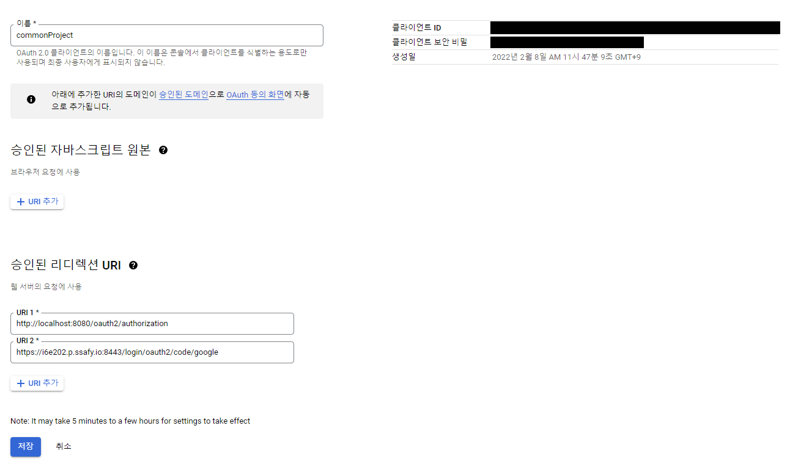
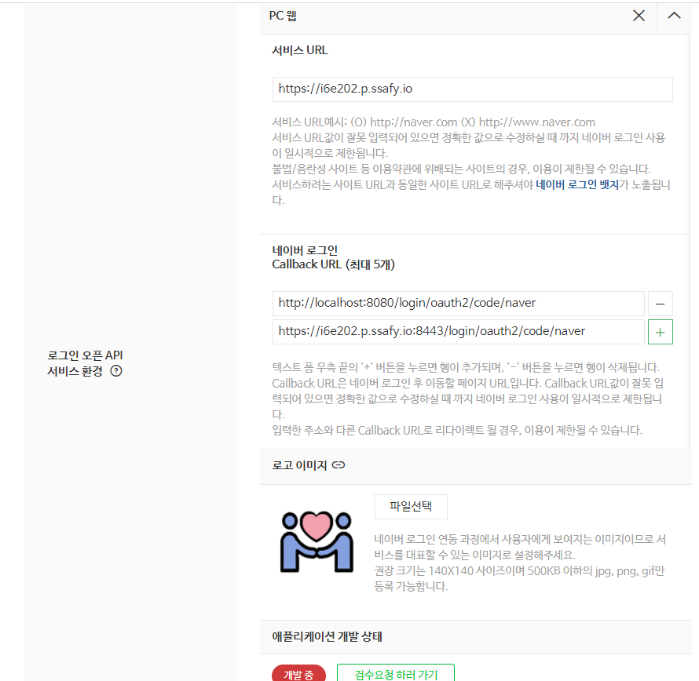

# 소셜 인증

## 1. 구글


<br><br>

## 2. 네이버



<br><br>

## 3. 카카오


<br/><br/><br/>

# OAuth 2.0

## OAuth 2.0란?
- Open Authorization 2.0, OAuth2

- 인증을 위한 개방형 표준 프로토콜

- third-Party 프로그램에게 리소스 소유자를 대신하여 리소스 서버에서 제공하는 자원에 대한 접근 권한을 위임하는 방식을 제공

- 간편 로그인 기능 구현을 위해 사용
    - 구글, 페이스북, 카카오, 네이버 등
<br/><br/>


## **OAuth 2.0 주요 용어**

| 용어 | 설명 |
| --- | --- |
| Authentication | 인증, 접근 자격이 있는지 검증하는 단계를 말합니다. |
| Authorization | 인가, 자원에 접근할 권한을 부여하는 것입니다. 인가가 완료되면 리소스 접근 권한이 담긴 Access Token이 클라이언트에게 부여됩니다 |
| Access Token | 리소스 서버에게서 리소스 소유자의 보호된 자원을 획득할 때 사용되는 만료 기간이 있는 Token입니다. |
| Refresh Token | Access Token 만료시 이를 갱신하기 위한 용도로 사용하는 Token입니다. Refresh Token은 일반적으로 Access Token보다 만료 기간이 깁니다. |


<br/><br/>

## accessToken

- 아이디 / 비밀번호가 아니라서 안전
- 나의 서비스에서 꼭 필요한 기능 일부분만 이용할 수 있는 장점

<br/><br/>    

## 역할 구분


### 1. **Resource Owner**
- 고객, 사용자

<br/>

### 2. **Client**
- 나의 서비스

<br/>

### 3. **Resource Server**
- 구글, 페이스북, 네이버 등 고객의 정보를 제공하는 곳

<br/>

### 4. **Authorization Server**
1. 인증 관련한 처리를  하는 서버
2. 공식 문서에는 Resource / Authorization 두 가지 서버로 나눠져 있음
3. 여기선 간단한 설명을 위해 Resource Server로 합쳐서 설명

<br/>

## Register

### 1. 사전에 승인을 받아 놓아야 한다.

<br/>

### 2. 등록하는 방법은 각 Resource Server마다 다르지만 공통적인 세가지
1. Client ID
    1. 우리가 만들고 있는 애플리케이션을 식별하는 식별자.
    2. 노출되어도 상관 없다.

<br/>

2. Client Secret
    1. 비밀번호
    2. 절대로 외부에 노출되면 안된다.

<br/>

3. Authorized redirect URLs
    1. Authorized : 권한을 부여하다.
    2. Resource Server가 권한을 부여하는 과정에서 Authorize Code를 전달해준다.
    3. 그 때 이 주소로 전달해 달라고 알려준 것.
    4. Resource Server는 다른 주소에서 요청을 하면 거부를 할 것이다.

<br/>

4. 각 Resource Server에 등록하는 방법은 생략
    1. 구글에서 검색해서 사용

<br/><br/>

## OAuth 작동 흐름

### 1. 고객의 정보를 사용하겠다는 동의가 필요하다.
- 각 Resource Server에 맞는 버튼을 클릭하는 것으로 동의를 얻는 것

<br/>

### 2. 그러면 아래와 같은 주소로 요청을 보낸다.
- scope의 경우에는 Resource Server에서 제공하는 기능 중 사용하고자 하는 기능


<br/>
    
### 3. Resource Owner가 Resource Server로 요청을 보내게 되면


<br/>

### 4. Resource Server는 로그인이 되어 있는지 확인하고 안되어 있으면 로그인 화면을 보낸다.
    


<br/>

### 5. 이후, 로그인 후 다시 요청이 들어오면 그때서야 Client Id와 redirect URL이 같은지 확인한다.

<br/>

### 6. 다르면 종료하고, 같으면 Client에게 Scope와 같은 기능 제공하는 것을 동의하는지를 묻는 페이지를 다시 보낸다.


<br/>

### 7. 동의를 하게 되면 Resource Server는 다음과 같은 user id와 제공한 기능을 저장해둔다.


<br/>

### 8. 이후 Client에게 바로 accessToken을 발급하지 않고 임시 비밀번호를 발급한다.

<br/>

### 9. authorization code를 Resource Owner에게 전송한다.
1. Location : https://client/callback?code=3
2. Header에 Location 붙여서 보냄, 의미는 Redirection 
3. Resource Server가 Resource Owner 브라우저에게 위의 주소로 이동하라고 명령을 내린 것


<br/>

### 10. Resource Owner의 브라우저가 Header Location의 명령에 따라 Client에게 요청을 보낸다.


<br/>

### 11. 그러면 Client는 Resource Server에게 자신이 가진 4가지 정보를 보낸다
1. Client Id, Client Secret, redirect URL, authorization code
2. 이러한 [authorization code를 이용하는 방법을 포함한 4가지 방법](#토큰-발급-방식(grant-type)은-총-4가지)이 있다.

<br/>

### 12. 4가지가 모두 일치하는지 확인 후에 access Token을 발급 한다.


### 13. 인증 후에 authorization code를 Client와 Resource Server에서 지운다.

<br/>

### 14. 그리고 AccessToken을 발급 해준다.

<br/>

### 15. Client가 AccessToken으로 접근을 할 때 다음과 같은 것을 보장한다.
- user id 1을 가진 사용자의  대한 정보, 유효한 기능 b, c를 accessToken 4를 가진 Client 허용


<br/><br/>


## 토큰 발급 방식(grant type)은 총 4가지

- 기본적으로 헤더에 authorization 값(clientid:secretkey base64 인코딩한 값)을 넣어서 요청

<br/>

### 1. code (code를 발급받고 code로 access token 발급)

1. code 발행
    - 아래 url은 기본 oauth2.0 코드 발급 URI로 절차 완료시 redirect_uri 로 code 가 발행된다.
    - URL : http://localhost:8080/oauth/authorize
    - Parameter
        - response_type=code
        - redirect_uri=코드 전달받을 URL
        - scope=read

<br/>

2. access token 발행
    - 발급 받은 코드를 가지고 token 을 발행 한다.
    - URL : http://localhost:8080/oauth/token
    - Parameter
        - grant_type=code
        - authorization_code=발급받은코드
        - redirect_uri=코드 전달받은 URL

<br/>

### 2. password (id, pw 로 access token 발급)

- access token 발행
    - id, pw 로 토큰을 바로 발급 받을 수 있다.
    - URL : http://localhost:8080/oauth/token
    - Parameter
        - grant_type=password
        - username=아이디
        - password=패스워드
        - scope=read

<br/>

### 3. client_credentials (바로 access token 발행)

- 다른 정보를 요하지 않고 authorization 에 clientid, secret key만 등록된 정보면 바로 발행
- 그런 특성으로 정말 별다른 인증 필요 없는 신뢰도가 높은 클라이언트에게만 해당 방식을 허용
- 해당 방식은 별다른 인증을 요하지 않기에 위험성이 있어 refresh_token은 따로 발행 하지 않음
- URL : http://localhost:8080/oauth/token
- Parameter
    1. grant_type=client_credentials
    2. scope=read
    
<br/>

### 4. refresh_token (refresh token으로 access token 발행)

- 해당 방식은 1, 2번으로 인증 후 재 로그인 없이 자동 로그인을 구현하기 위함
- 1,2 방식으로 access_token 발행과 동시에 refresh_token 도 같이 발행해주기에 얻은 refresh token로 token 발행이 가능하다.
- URL : http://localhost:8080/oauth/token
- Parameter
    1. grant_type=refresh_token
    2. refresh_token=이전에 발급받은 refresh token
    3. scope=read

<br/>

## Refresh Token
1. Access Token은 수명이 있다.
    - 짧으면 몇 시간, 길게는 60일 90일 단위로 살아있다.
    - 수명이 끝나면 더 이상 API에 접속해도 데이터를 주지 않는다.

<br/>

2. 수명이 끝날 때 마다 Access Token을 다시 발급하게 하는 과정을 사용자에게 겪게 하면 불편

<br/>

3. oauth 2.0 RFC 
    - RFC는 인터넷과 관련된 여러가지 표준안
    - [https://datatracker.ietf.org/doc/html/rfc6749#section-1.5](https://datatracker.ietf.org/doc/html/rfc6749#section-1.5)

<br/>
    

    
### 1. A : 권한을 획득 / 허가 한다.
<br/>

### 2. B : Access / Refresh Token 둘 다 발급 받는다.
<br/>

### 3. C : Access Token으로 인증
<br/>

### 4. D : 보호되고 있는 자원
<br/>

### 5. E : Access Token으로 인증
<br/>

### 6. F : 인증되지 않은 토큰
<br/>

### 7. G : Refresh Token으로 인증
<br/>

### 8. H : Access Token 다시 발급 받는다.
- Refresh Token도 다시 발급 되는 곳도 있다.
- **Google Doc - Refreshing an access token**
```json
// Request
POST /token HTTP/1.1
Host: oauth2.googleapis.com
Content-Type: application/x-www-form-urlencoded

client_id=your_client_id&
client_secret=your_client_secret&
refresh_token=refresh_token&
grant_type=refresh_token

// Response
{
    "access_token": "1/fFAGRNJru1FTz70BzhT3Zg",
    "expires_in": 3920,
    "scope": "https://www.googleapis.com/auth/drive.metadata.readonly",
    "token_type": "Bearer"
}
```

## 기술 구현

<br/>

## 참조한 사이트
1. https://deeplify.dev/back-end/spring/oauth2-social-login

2. https://velog.io/@swchoi0329/스프링-시큐리티와-OAuth-2.0으로-로그인-기능-구현#5-세션-정장소로-데이터베이스-사용하기

<br/>

## Front End 구현
- 요청을 보내는 URL & Redirect URL
``` html
<!-- 구글 -->
<a class="social_btn" href="https://i6e202.p.ssafy.io:8443/oauth2/authorization/google?redirect_uri=https://i6e202.p.ssafy.io/oauth/redirect"></a>

<!-- 네이버 -->
<a class="social_btn" href="https://i6e202.p.ssafy.io:8443/oauth2/authorization/naver?redirect_uri=https://i6e202.p.ssafy.io/oauth/redirect"></a>

<!-- 카카오 -->
<a class="social_btn" href="https://i6e202.p.ssafy.io:8443/oauth2/authorization/kakao?redirect_uri=https://i6e202.p.ssafy.io/oauth/redirect"></a>

```

<br/>

## Back End 구현

### 1. aplication properties, gradle 설정 내용 생략
<br/>

### 2. SecurityConfig에 요청을 받는 코드를 구현
```java
public class SecurityConfig extends WebSecurityConfigurerAdapter {
   
   ...

    @Override
    protected void configure(HttpSecurity http) throws Exception {
        http

                ...
                // 인증이 필요한 부분 구글 oauth2Login부분
                .antMatchers("/oauth2/authorization/**").authenticated() 
                .and()
                .logout()
                .logoutSuccessUrl("/")
                .and()
                .oauth2Login()
                .userInfoEndpoint()
                .userService(customOAuth2UserService)
                .and()
                .successHandler(oAuth2AuthenticationSuccessHandler)
                .failureHandler(oAuth2AuthenticationFailureHandler);
    }
}
```

<br/>

### 3. CustomOAuth2UserService 구현하여 토큰 및 회원가입 자동 처리
```java
public class CustomOAuth2UserService implements OAuth2UserService<OAuth2UserRequest, OAuth2User> {

    private final UserRepository userRepository;

    @Override
    public OAuth2User loadUser(OAuth2UserRequest userRequest) throws OAuth2AuthenticationException {
        OAuth2UserService delegate = new DefaultOAuth2UserService();
        OAuth2User oAuth2User = delegate.loadUser(userRequest);

        // 구글 / 네이버 / 카카오 로그인인지 구분용
        String registrationId = userRequest.getClientRegistration().getRegistrationId();

        // 제공 타입
        String userNameAttributeName = userRequest.getClientRegistration()
                .getProviderDetails().getUserInfoEndpoint().getUserNameAttributeName();
                
        // 유저 토큰
        String userToken = userRequest.getAccessToken().getTokenValue();
        
        ...

        return new DefaultOAuth2User(
                Collections.singleton(new SimpleGrantedAuthority(user.getRoleKey())),
                attributes.getAttributes(),
                attributes.getNameAttributeKey());
    }
}
```

<br/>

### 4. OAuth2AuthenticationSuccessHandler / OAuth2AuthenticationFailureHandler 구현하여 성공, 실패결과 리턴
```java
@Component
public class OAuth2AuthenticationSuccessHandler extends SimpleUrlAuthenticationSuccessHandler {

    @Autowired
    private UserRepository userRepository;

    @Override
    public void onAuthenticationSuccess(HttpServletRequest request, HttpServletResponse response,
                                        Authentication authentication) throws IOException {
            
        ...

        String url = makeRedirectUrl(JwtTokenUtil.getToken(user.getEmail()));

        getRedirectStrategy().sendRedirect(request, response, url);
    }

    private String makeRedirectUrl(String token) {
        return UriComponentsBuilder.fromUriString("https://i6e202.p.ssafy.io:443/oauth/success")
                .queryParam("accessToken", token)
                .build().toUriString();
    }

}
```

<br/><br/>

## Trouble Shooting

<br/>

### 오류 원인
1. Redirect가 성공하여 Token은 정상적으로 넘어갔으나 액션이 동작하지 않는 다는 페이지가 나왔다.
2. 우선 FrontEnd, BackEnd 통합 빌드 배포가 아니다.
3. FrontEnd, BackEnd 각각, Docker 컨테이너 이미지로 따로 돌아간다.
4. 서로 Port 번호가 다름
    - FronEnd : 443
    - BackEnd : 8443
5. SuccessHandler, FailureHandler에서 Redirect를 할 때 포트 번호가 달라 문제가 생겼다.


<br/>

### 해결 방법
1. SuccessHandler에 redirect하는 부분에 도메인:443/oauth/success로 직접 포트 지정
2. Failure도 같은 방식으로 바꿔, 정상적으로 동작하도록 수정


<br><br>

# 4. S3(Simple Storage Service)
- AWS에서 제공하는 객체 스토리지 서비스
 
- 서비스 과정에서 사용되는 프로필 이미지 파일들을 업로드 하여 관리하기 위해서 사용

<br/>

### 1. AWS S3 bucket 생성
``` yml
  1. [AWS -> S3 -> 버킷 만들기]에서 새로운 버킷을 만든다.
  2. 퍼블릭 액세스를 허용해준다.
  3. 권한 -> 버킷 정책으로 들어가서 정책을 설정한다.
  
  {
      "Version": "2012-10-17",
      "Id": "Policy1644805559372",
      "Statement": [
          {
              "Sid": "Stmt1644805556206",
              "Effect": "Allow",
              "Principal": "*",
              "Action": [
                  "s3:GetObject",
                  "s3:PutObject"
              ],
              "Resource": "arn:aws:s3:::[버킷 이름]/*"
          }
      ]
  } 
```

<br/>

### 2. AWS IAM 사용자 생성
```Text
  AWS 액세스 유형 : 프로그래밍 방식 액세스

  권한 설정 : AmazonS3FullAccess 선택

  AccessKey와 Secret Key 저장
```

<br/>

### 3.  build.gradle에 의존성 추가
```gradle
  implementation("io.awspring.cloud:spring-cloud-aws-context:2.3.3")

  implementation("org.springframework.cloud:spring-cloud-aws-autoconfigure:2.2.6.RELEASE")
```

<br/>

### 4. s3 config 파일 추가
```java
  public AmazonS3Client amazonS3Client() {
      BasicAWSCredentials awsCreds = new BasicAWSCredentials(accessKey, secretKey);
      
      return (AmazonS3Client) AmazonS3ClientBuilder.standard()
              .withRegion(region)
              .withCredentials(new AWSStaticCredentialsProvider(awsCreds))
              .build();
  }
```

<br/>

### 5. S3 service 클래스 추가
```java
  public String upload(MultipartFile uploadFile) throws IOException { ... }

  public void deleteFile(String fileName) { ... }

  private static String getUuid() { ... }

  private void uploadOnS3(final String findName, final File file) { ... }

  public String findImg(String img) { ... }

```